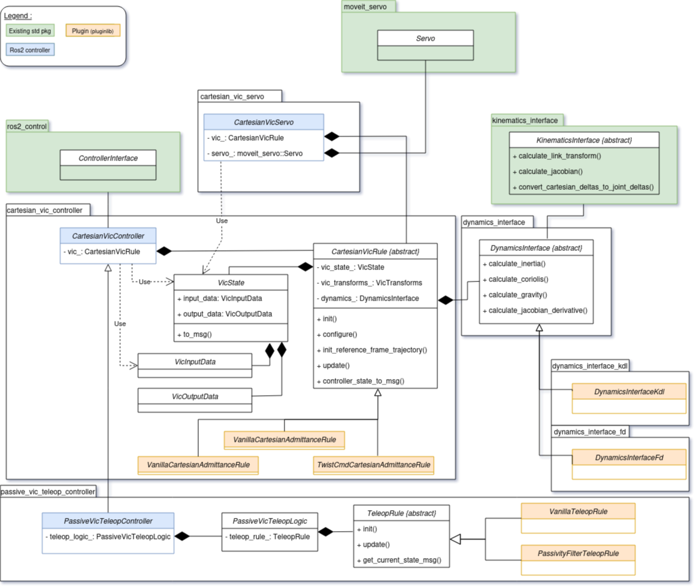
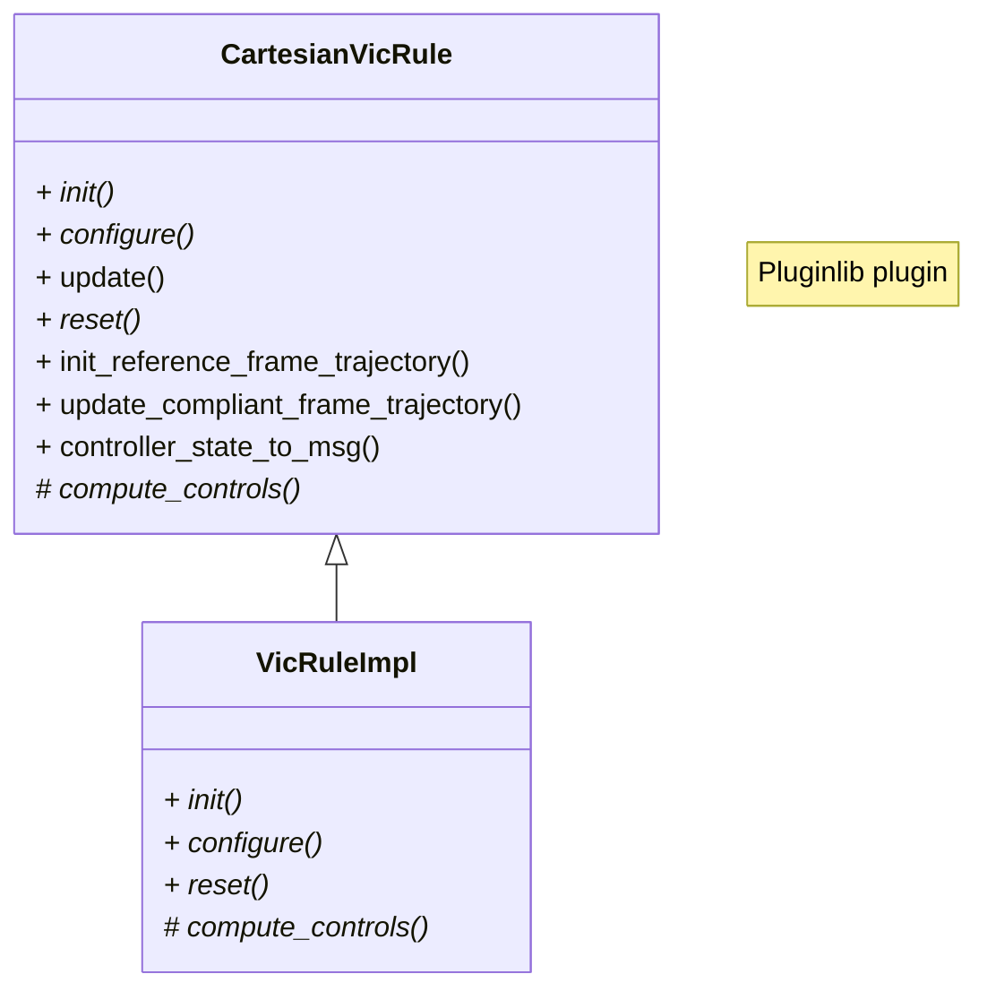

# cartesian_controllers_ros2
Set of cartesian controllers for ros2_control


***The current devs are based on the jazzy ROS 2 distribution (Ubuntu 24.04 LTS)***

[](https://github.com/ICube-Robotics/cartesian_controllers_ros2/actions/workflows/ci.yml)


# Installation of the package

```bash
# Create a ros2 workspace with a source dir inside
mkdir -p ws_cartesian_controllers/src

# GOTO source dir
cd ws_cartesian_controllers/src

# clone this repos
git clone https://github.com/ICube-Robotics/cartesian_controllers_ros2.git

# Use VCS to clone (and checkout the correct branches) the repositories of the deps
vcs import . < cartesian_controllers_ros2/cartesian_controllers_ros2.repos

# GOTO source dir
cd ..

# Source ROS2 distro
source /opt/ros/jazzy/setup.bash

# Install the dependencies of ALL packages
# sudo rosdep init && rosdep update
rosdep install --ignore-src --from-paths . -y -r

# Build
colcon build --cmake-args -DCMAKE_BUILD_TYPE=Release --symlink-install

# Source this workspace
source install/setup.bash
```

## Code organization

### Overview

The following diagram describes the relation between packages:

Note that this class diagram is NOT comprehensive and only features the main relations.

The main core ROS dependencies are `ros_control`, `generate_parameters_library`, `kinematics__interface`.
The VIC controller makes use of the [dynamics_interface](https://github.com/tpoignonec/dynamics_interface) package for dynamic model access (based on kinematics_interface).

Additionally, the servo-based VIC implementation naturally requires the `moveit2` stack, including the latest `moveit_servo` package.

__Packages:__
- `cartesian_control_msgs`: definition of main messages for VIC controllers state and references. Additionally, messages representing the Cartesian state of a manipulator robot are defined here.
- `cartesian_state_broadcaster`: simple controller to broadcast the cartesian state (pose + velocity + force).
- `cartesian_vic_controller`: main repos, see following section.
- `cartesian_vic_teleop_controller`: extension of `cartesian_vic_controller` to bilateral VIC-based teleoperation.
- `cartesian_vic_servo`: alternative implementation for VIC (admittance controller only) using MoveIt2 servo as underlying Cartesian velocity controller.

### Cartesian VIC controller

This is the main package that defines the control logic and the default VIC controller (based on ros-control).
As visible in the diagram class diagram, the main control logic (see details in [cartesian_vic_controller/README.md](./cartesian_vic_controller/README.md)) is provided by the `CartesianVicRule` class.



The base class `CartesianVicRule` provide the logic for robot state processing and packaging (see `VicInputData` class).
It is also responsible for managing robot kinematic / dynamics  and measurement filtering.
The `update()` function inernally calls the `compute_controls()`, a pure virtual function that has to be provided by actual VIC implementations.

Each rule inherits from `CartesianVicRule` and provide an implementation of `compute_controls`, whose signature is as follows:

```cpp
bool CartesianVicRule::compute_controls(
    double dt /*period in seconds*/,
    const VicInputData & vic_input_data,
    VicCommandData & vic_command_data);
```

The implementation compute VIC controls from the `VicInputData` and returns commands in the form of a `VicCommandData` object. For instance, if the implementation is based on position control (e.g., admittance control) the following is valid:

```cpp
// Set position reference
vic_command_data.joint_command_position = <...>;

// Set flags for available commands
// - Cartesian space
vic_command_data.has_twist_command = false;
// - joint space
vic_command_data.has_position_command = true;
vic_command_data.has_velocity_command = false;
vic_command_data.has_acceleration_command = false;
vic_command_data.has_effort_command = false;
```

__Provided VIC rule implementations:__

- `VanillaCartesianAdmittanceRule`: a basic admittance control law that returns position and velocity (__recommended!__) commands.
- `VanillaCartesianImpedanceRule`: a basic impedance control law that returns torque (i.e., `EFFORT`) commands.
- `TwistCmdCartesianAdmittanceRule`: Same as `VanillaCartesianAdmittanceRule`, but the inverse kinematics is not handled.
Note: this plugin is not compatible with the nominal controller, it is designed for `cartesian_vic_servo`.

## Examples

See the repos [ICube-Robotics/cartesian_controllers_ros2_examples](https://github.com/ICube-Robotics/cartesian_controllers_ros2_examples).
