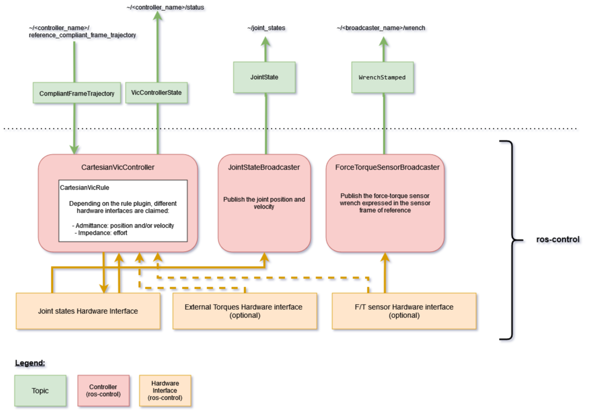

# cartesian_vic_controller

This is a cartesian VIC controller inspired by the package `admittance_controller` from [ros-controls/ros2_controllers](https://github.com/ros-controls/ros2_controllers/tree/master).

> [!WARNING]
>
> This package is currently under development and possibly unsafe if used to control an actual robot!
> For instance, a singularity avoidance strategy has still to be implemented in the default VIC.

## Control law

Let us consider a $n-DoF$ serial manipulator robot whose dynamics can be modeled as

$$
\begin{align}
  H(q) \ddot{q} + C(\dot{q}, q) + G(q) = \tau_c + J(q) f_{ext}
\end{align}
$$

where $H(q) \in \mathbb{R}^{n \times n}$ is the joint space inertia matrix, $C(\dot{q}, q) \in \mathbb{R}^{n}$ contains the coriolis and centrifugal terms, $G(q) \in \mathbb{R}^{n}$ represents the gravity terms, and $f_{ext}$ is the external wrench.

> [!NOTE]
> In the code as well as in the following, we define $J(q)$ as the "geometrical" Jacobian matrix, not the analytical one usually used in papers and textbooks.
> The reason is that we do not need/want to choose an angle parameterization (i.e., Euler, Yaw-Pitch-Roll, Quaternions, etc.) if not strictly required by the application.
> The orientation is provided to the controller in the form of a rotation matrix and we use angle-axis representation to compute orientation errors in the VIC rules.
> However, note that other rule implementations (e.g., QP, NMPC, etc.) will require an appropriate parameterization of the robot orientation and make the use of the geometrical Jacobian incorrect...
> For instance, see  [this document](https://www.diag.uniroma1.it/deluca/rob2_en/15_ImpedanceControl.pdf) for reference.

The controller imposes the following cartesian behavior

$$
\begin{align}
  M \ddot{e} + D \dot{e} + K e = f_{ext} - f_{ref}
\end{align}
$$

where $e = p^d - p$, $M$ and $D$ are the (positive definite) desired inertia and damping matrix, respectively, and $K^d$ is the (positive semi-definite) desired stiffness matrix.
The reference force $f_{ref}$ is the force that the robot will apply in the absence of interference with the K and D terms (i.e., if $K \tilde 0$, then $f_{ext} \tilde f_{ref}$ in permanent regime).

The cartesian acceleration command $\ddot{p}^c$ is therefore computed as

$$
\begin{align}
  \ddot{p}^c = \ddot{p}^d + M^{-1} \left( D \dot{e} + K \dot{e} - f_{ext} + f_{ref} \right)
\end{align}
$$

### 1) Admittance control mode

The cartesian acceleration is integrated to obtain the cartesian velocity command $\dot{p}^c$.

The joint velocity command $\dot{q}^c$ is computed from $\dot{p}^c$ using the `kinematics_interface`.

In order to accommodate for both the `position` and `velocity` command interfaces, the joint velocity command $\dot{q}^c$ is integrated to provide a joint position command ${q}^c$ such that

$$
\begin{align}
  {q}^c &= q + T_s \dot{q}^c
\end{align}
$$

where $q$ is the **measured** joint position and $T_s$ is the controller sampling time.

See [vanilla_cartesian_admittance_rule](src/rules/vanilla_cartesian_admittance_rule.cpp) for implementation details.

### 2) Impedance control mode

The joint acceleration command is first computed as

$$
\begin{align}
  \ddot{q}^c = J^{\dagger} \left( \ddot{p}^c - \dot{J}(q) \dot{q} \right)
\end{align}
$$

Then, the joint torque control is computed from $\ddot{q}^c$ such that, if the gravity compensation is deactivated,

$$
\begin{align}
  \tau^c = H(q) \ddot{q}^c - J(q)^{T} f_{ext}
\end{align}
$$

If the gravity compensation is activated (see `vic.activate_gravity_compensation` parameters), the control law becomes

$$
\begin{align}
  \tau^c = H(q) \ddot{q}^c + C(\dot{q}, q) + G(q) - J(q)^{T} f_{ext}
\end{align}
$$

See [vanilla_cartesian_impedance_rule](src/rules/vanilla_cartesian_impedance_rule.cpp) for implementation details.

## Topics




- `~/compliant_frame_reference` (input topic) [`cartesian_control_msgs::msg::CompliantFrameTrajectory`]

  Target (cartesian) compliant frame containing at least a pose, a twist.

  Additionally, a desired compliance (stiffness, damping, inertia) can be provided for each reference cartesian state in the trajectory.
  Otherwise, the ros parameters are used to retrieve the default values.
  For instance you could provide the following default impedance parameters:

  ```yaml
  <controller_name>:
    vic:
      frame:
        id: <vic_reference_frame> # e.g., tool0 or world

      inertia: [1.0, 1.0, 1.0, 0.1, 0.1, 0.1]
      damping_ratio: [1., 1., 1., 1., 1., 1.]
      stiffness: [200., 200., 200., 50., 50., 50.]
  ```

- `~/status` (output topic) [`cartesian_control_msgs::msg::VicControllerState`]

  Topic publishing controller internal states.


## ros2_control interfaces

### States

The state interfaces are defined with ``joints`` and ``state_interfaces`` parameters as follows: ``<joint>/<state_interface>``.
The necessary state interfaces are ``position`` and ``velocity``.
**Both are mandatory!**

The `Force Torque Sensor` semantic component is used and requires force state interfaces (optional, depending on rule requirements).
To disable the force-torque sensor, set `ft_sensor.is_enabled` to false.

  ```yaml
  <controller_name>:
    ...
    ft_sensor:
      is_enabled: false
      name: ""  # sensor name in URDF
      frame:
        id: ""  # F/T sensor frame (in which the wrench is expressed)
    ...
  ```

Similarly, some rules can use external torque sensor (e.g., useful for nullspace control)

  ```yaml
  <controller_name>:
    ...
    external_torque_sensor:
      is_enabled: false  # set to true to enable
      name: ""  # sensor name use by the semantic component
    ...
  ```


### Commands

- Admittance control:

  Ideally, the control interface is a joint `velocity` group.
  The controller can also use a `position` command interface.

- Impedance control:

  `effort` command interface required.
